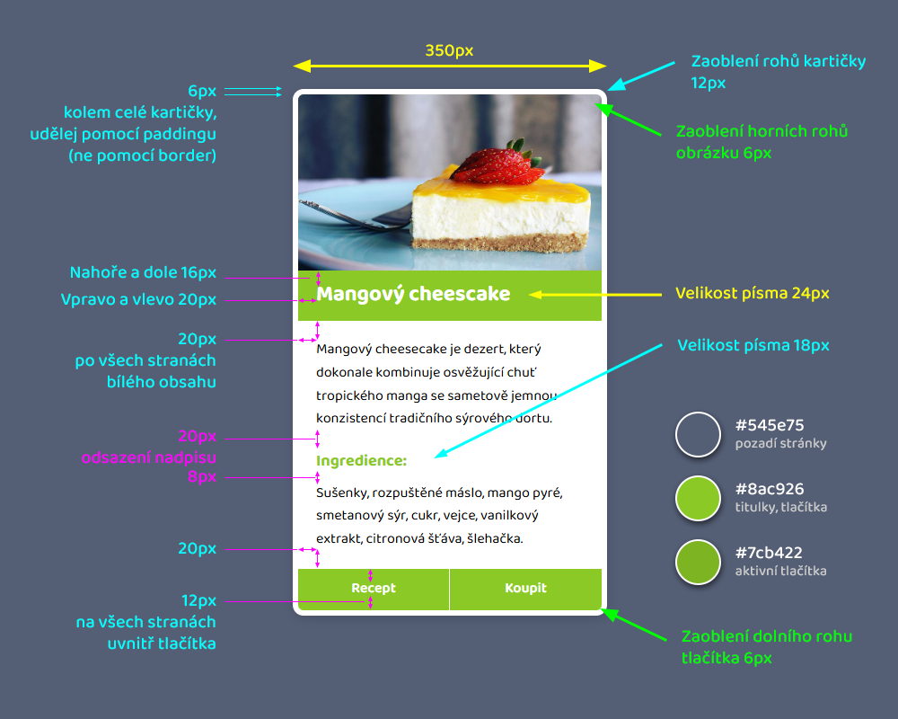
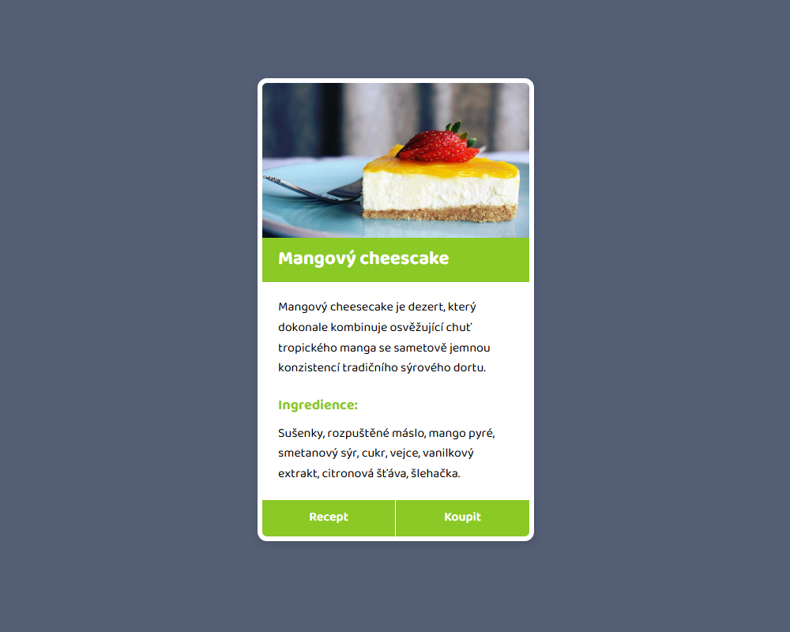

# Projekt Cheesecake

*Cvičný projekt pro kurz HTML a CSS (blended) od Czechitas.*

- V HTML máš připravený obsah.
- Přidej další značky, pokud uznáš za vhodné.
- Přidej si na značky CSS třídy, abys mohla prvky stylovat.
- Do HTML připoj CSS soubor.
- Nastyluj stránku podle zadání níže.
- Na výsledek se můžeš podívat v obrázku **ukazka-vysledku.jpg** (připojený na konci stránky).

## Zadání

Použij margin a padding a dodrž rozměry podle obrázku níže.

**POZOR:** Vzpomeň si, že spousta HTML prvky (nadpisy, odstavce) má už nějaký margin nastavený od prohlížeče jako výchozí hodnotu. Možná budeš muset některým prvkům margin vynulovat nebo přenastavit.

## Písmo

- Použij písmo [Baloo Bhaijaan 2](https://fonts.google.com/specimen/Baloo+Bhaijaan+2?lang=cs_Latn) z Google Fonts.
- Toto písmo nastav pro celou stránku (všechny texty budou tímto písmem)

## Barvy

- #545e75 - pozadí stránky
- #8ac926 - zelená pro pozadí titulku, podnadpis a tlačítka
- #7cb422 - tmavší zelená pro tlačítka při najetí myší

## Tipy

- obrázku nastav šířku `100%` - obrázek se tak bude přizpůsobovat šířce rodiče, ve kterém leží
- obrázku nastav `display: block;` - odstraníš tak malou mezeru, která by se jinak objevovala pod obrázkem
- hlavnímu titulku v zeleném rámečku nastav `line-height: 1;` - velikost řádku 1 znamená, že nad a pd textem nebude žádná mezera navíc, kromě paddingu/marginu, který si sama nastavíš
- aby to vypadalo hezčí, můžeš kartičce nastavit jemný stín pomocí `box-shadow: 1px 3px 12px rgba(0, 0, 0, 0.15);`

## Ukázka výsledku

